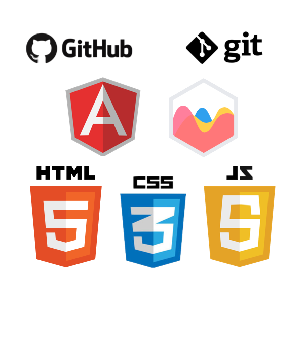

# Description

SmartNotes is a web app that allows users to optimize their study time by combining note taking and flash cards. As you take notes you can easily mark keywords and either define them right then or define them later. You can then review and/or quiz yourself on these keywords and the app will also keep track of your quiz data and will display your data upon clicking on the session in the data page. Another convenient aspect of the app is that they're saved online, meaning if you have access to internet you can access them anywhere. 

<br>

## Technologies

|   Technology |   Deployment |       
|  ----------- | ------------|
|   Angular JS | [heroku](https://smart-notes.herokuapp.com/#/) |
|   node.js    ||
|   express.js ||
|   chart.js ||
|   angular-chart.js||
|   HTML       ||
|   CSS        ||
|   JavaScript ||

<br>

 
<br>

##  Deck Model

| Parameters  | Value   	| Description | Example |
| ----------- | ----------	| ------------ | ------- |
| Deck name   | String 		| If this isn't named it will be set to a default name. | "Deck #1" |
| Posted by | String | Takes in the first and last name of the user. | "Roger Chavez"
| Posted Date| Date  	| Automatically get's the date, on creation. | 07/03/2017 |
| Posted Time	| Date  	| Get's the current time, on creation.	   	 | 17:38 |
| Keywords 		| array    	| Stores keyword objects. 	   	 | Object example below |

```
{
    id: 1, 
    keyword:"Example", 
    definition: "A thing characteristic of its kind or illustrating a general rule." 
}
```

## Keyword Model
|Parameters| Value| Description| Example|
|----------|------|------------|--------|
| Id| Number| Easily distinguishes one card from the next.| 777|
| Keyword | String| This can be a vocabulary word or key concept.| Newton's Third Law |
| Definition| string| This is the statement that gives meaning to the keyword.| "For every action, there is an equal and opposite reaction."

## Session model
|Parameters| Value| Description| Example|
|----------|------|------------|--------|
| Deck id tested | Number| Displays the id for the deck used in a given study session.| 0 |
| Deck Name | String|Displays the name for the deck used in a given study session.| "Deck #1" |
| Posted Date| Date  	| Automatically get's the date, on creation. | 07/07/2017 |
| Posted Time	| Date  	| Get's the current time, on creation.	   	 | 12:34 |
| Duration	| Date  	| Displays total time spend studying.	   	 | 12:34 |
| Session name	| sting | Allows a user to easily distinguish sessions when looking at their study data. 	 | "MidTerm practice quiz #3" |
| results	| array | Stores result objects. | Object example below|
```
{
    cardID: 0,
    keyword: "Constellation",
    correct: 9,
    wrong: 2,
    total: 11,
    percentage: 82
} 
``` 

## Result model
|Parameters| Value| Description| Example|
|----------|------|------------|--------|
| Card id | Number| Stores the id of the keyword in a given study session.| 0 |
| Keyword | String| Stores the name of the keyword used in a given study session.| "Constellation" |
| Correct| number  	| Displays the number of times a student answered correctly. | 9|
| Wrong | number  	| Displays the number of times a student answered wrong. | 2|
| Total | number  	| Displays the total number of times a student answered. | 11|
| Percentage | number  	| Displays a percentage, rounded to the nearest whole number, for the correct answers. | 82|

<br>

## Planning and Approach
We came into this project having a good idea of what we wanted to do. From the get go we were both interested in solving different problems for app. We entrusted each other to work on the areas of the app we were interested in and kept communicating what changes we had successfully made, what we were currently working on and our stretch goals if we had sufficient time. We started in the backend trying to think through all the ways we needed to be able to use a note and keyword, and we adjusted the model accordingly.  

## Challenges
- Manipulating API to get correct information needed for functionality of the App.
- Comming up with a way to parse through notes and pick out the keywords. 
- Comming up with a way to make a quiz using the keyword object and storing the quiz study session data.

